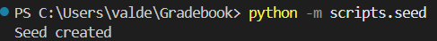
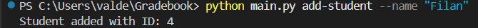
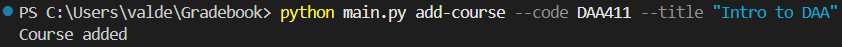
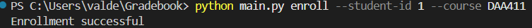
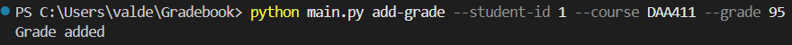
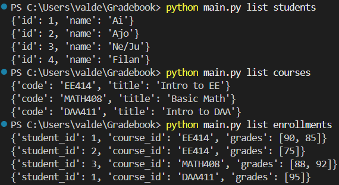
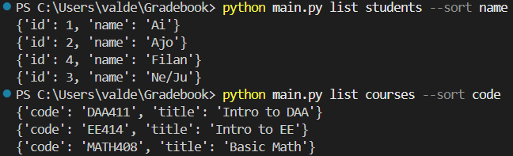
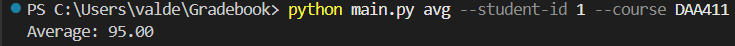
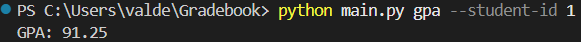

### Gradebook CLI

This project is a small usable command-line application with Python fundamentals from PE1/PE2.

# Design Decisions & Limitations

Python- Is used for implementing the core logic.
argparse(CLI)- The argparse module is used to create a command-line interface(CLI).
JSON- Data is stored in Json file.
Modular Design (Packages & Modules)- The project is structured into modules (models, service, storage, service, utils) inside a package.

# How it works (Step by Step)

## Run the following command to generate sample data:
```bash
python -m scripts.seed
```

# This will automatically create:
Students
Courses
Enrollments
Grades

## 1. Add a student
```bash
python main.py add-student --name "Filan"
```

# Creates a new student and assigns a unique ID.

## 2. Add a course
```bash
python main.py add-course --code DAA411 --title "Intro to DAA"
```

# Creates a new course identified by its code.

## 3. Enroll the student in a course
```bash
python main.py enroll --student-id 1 --course DAA411
```

# Links a student to a course (creates an enrollment).

## 4. Add a grade
```bash
python main.py add-grade --student-id 1 --course DAA411 --grade 95
```

# Adds a grade (0–100) to the student for that course.

## 5. List data
```bash
python main.py list students
```
# Displays all students.

```bash
python main.py list courses
```
# Displays all courses.

```bash
python main.py list enrollments
```
# Shows which students are enrolled in which courses and their grades.


## 6. Sort data
```bash
python main.py list students --sort name
```
# Sorts students alphabetically.
```bash
python main.py list courses --sort code
```
# Sorts courses by code.


## 7. Compute average
```bash
python main.py avg --student-id 1 --course DAA411
```

# Calculates the average grade for a student in a specific course.

## 8. Compute GPA
```bash
python main.py gpa --student-id 1
```
# Calculates the overall GPA (average of all course averages for that student).


## Important Order

# Commands must be executed in this order:

```text
add-student → add-course → enroll → add-grade → avg/gpa
```
